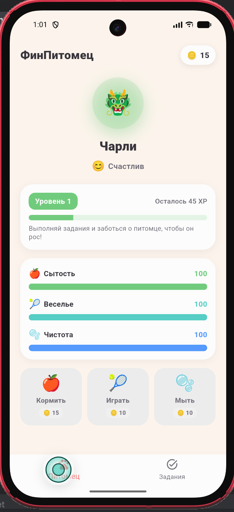
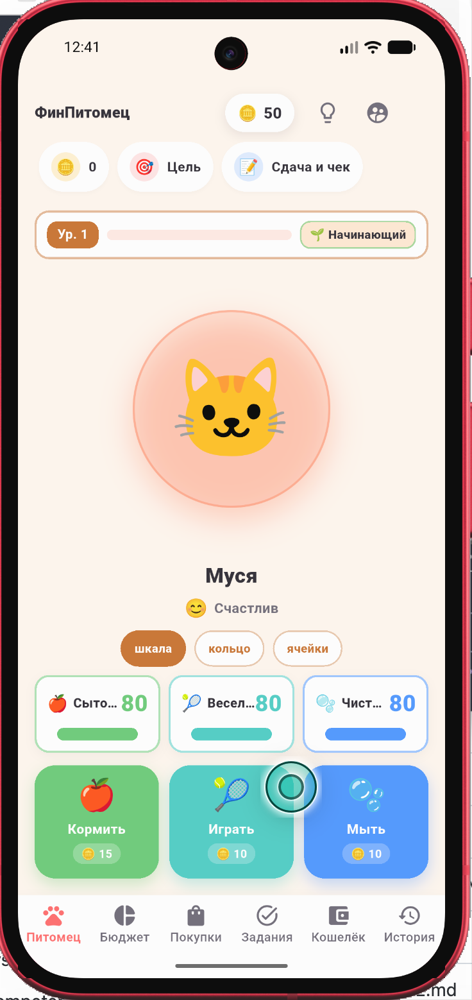
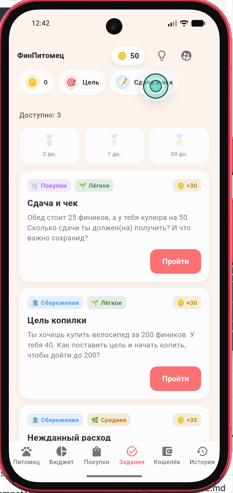
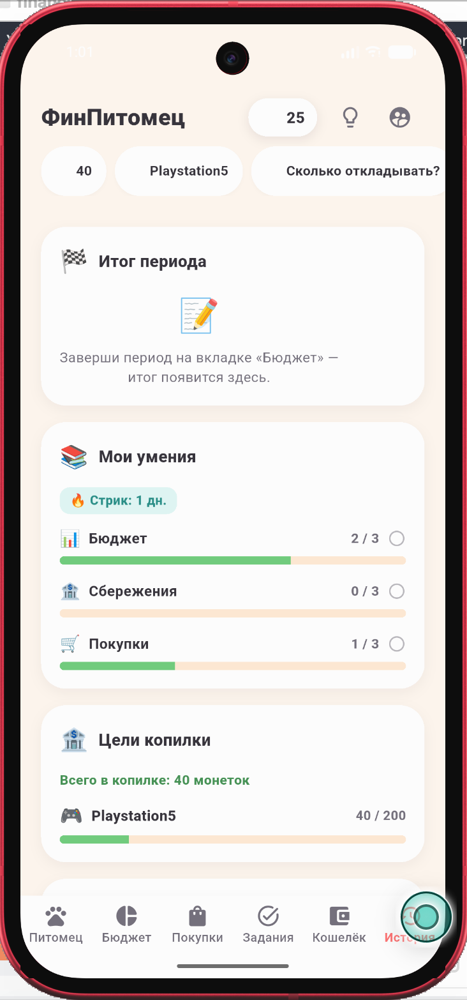

# ФинПитомец

Мобильное приложение по финансовой грамотности для детей 7–11 лет. Ребёнок создаёт виртуального питомца, планирует бюджет, выполняет задания и копит на цель — состояние питомца зависит от финансовых решений.

- **Платформы:** Android 8.0+ (API 21+), iOS 14+, macOS 14+ (Apple Silicon)
- **Язык интерфейса:** русский
- **Работает офлайн:** нет зависимостей от сети, сервера, аккаунтов

## Локальный запуск

### Требования

| Компонент | Минимальная версия | Где взять |
|---|---|---|
| Flutter SDK | 3.22+ (Dart 3.13+) | https://docs.flutter.dev/get-started/install |
| Android Studio | Ladybug (2024.2)+ | https://developer.android.com/studio |
| Android SDK | API 34 (compile) / API 21 (min) | Устанавливается через Android Studio |
| Java JDK | 17 | Входит в Android Studio |

Проверка установки:

```bash
flutter doctor
```

Все пункты должны быть зелёные (✓). Если Android SDK или эмулятор не найдены — следуйте подсказкам `flutter doctor --android-libs`.

### Запуск на эмуляторе

1. **Создать эмулятор** (один раз):

   - Android Studio → **Tools → Device Manager**
   - **Create Device** → выбрать телефон (например Pixel 6)
   - **Choose a System Image** → API 34 (UpsideDownCake) или новее
   - **Finish** → запустить эмулятор (иконка ▶️)

2. **Запустить приложение:**

   ```bash
   cd financial_pet
   flutter run
   ```

   Команда автоматически найдёт запущенный эмулятор и установит debug-сборку.

   Если подключено физическое устройство (Android Debug Bridge):
   ```bash
   # увидеть список устройств
   flutter devices

   # запустить на конкретном устройстве
   flutter run -d <device-id>
   ```

### Сборка APK

```bash
# Debug APK (для локальной проверки)
flutter build apk --debug
# → build/app/outputs/flutter-apk/app-debug.apk

# Release APK
flutter build apk --release
# → build/app/outputs/flutter-apk/app-release.apk
```

Установка на устройство:

```bash
adb install build/app/outputs/flutter-apk/app-debug.apk
```

Или перетащить файл APK на устройство и открыть.

### Сборка AAB (для RuStore)

```bash
flutter build appbundle --release
# → build/app/outputs/bundle/release/app-release.aab
```

> ⚠️ Релизная сборка сейчас подписана debug-ключом (см. `android/app/build.gradle.kts`). Перед публикацией в RuStore нужно настроить собственный signing config.

---

## Сборка под iOS

### Требования (macOS)

| Компонент | Минимальная версия | Где взять |
|---|---|---|
| macOS | 14+ (Sonoma) | — |
| Xcode | 15+ | Mac App Store |
| Flutter SDK | 3.22+ | Как для Android |
| Apple ID | — | https://developer.apple.com (для release) |

Проверка:

```bash
flutter doctor
```

Пункт `[✓] Xcode - DEVELOPER_DIR = ...` должен быть зелёным. Если `xcode-select` указывает на CommandLineTools:

```bash
sudo xcode-select -s /Applications/Xcode.app/Contents/Developer
```

### Запуск на iOS-симуляторе

```bash
# Убедиться, что iOS-платформа включена
flutter config --enable-ios

# Увидеть доступные симуляторы
flutter devices
# (в списке появятся iPhone 17, iPhone 18 Pro и т.д.)

# Запустить
flutter run -d "iPhone 18 Pro"
```

Или без `flutter run` (вручную):

```bash
# 1. Запустить симулятор
xcrun simctl boot "iPhone 18 Pro"
open -a Simulator

# 2. Собрать и установить
flutter build ios --debug --simulator
xcrun simctl install "iPhone 18 Pro" build/ios/iphonesimulator/Runner.app

# 3. Запустить
xcrun simctl launch "iPhone 18 Pro" ru.rustore.financialPet
```

### Сборка для устройства (release)

Для установки на физический iPhone нужен **Apple Developer аккаунт** (бесплатного достаточно для разработки):

1. Открой проект: `open ios/Runner.xcworkspace`
2. Target **Runner** → **Signing & Capabilities** → выбери **Team**
3. Xcode автоматически создаст Development Certificate + Provisioning Profile
4. Собрать:

```bash
flutter build ios --release
# → build/ios/iphoneos/Runner.app
```

### Экспорт .ipa

```bash
# Через Xcode: Product → Archive → Distribute App → Custom → Development
# Или вручную:
cd build/ios/iphoneos
mkdir -p Payload && cp -R Runner.app Payload/
zip -r -X FinancialPet.ipa Payload
rm -rf Payload
# → FinancialPet.ipa
```

> ⚠️ IPA без подписи (`--no-codesign`) можно собрать командой `flutter build ios --release --no-codesign`, но установить на устройство её нельзя — только для артефакта.

### Полезные команды (iOS)

| Команда | Что делает |
|---|---|
| `flutter run -d <simulator>` | Запуск на симуляторе с hot-reload |
| `flutter build ios --debug --simulator` | Debug-сборка для симулятора |
| `flutter build ios --release` | Release-сборка для устройства (нужна подпись) |
| `flutter build ios --release --no-codesign` | Release без подписи (только артефакт) |
| `xcrun simctl list devices available` | Список симуляторов |
| `xcrun simctl shutdown all` | Остановить все симуляторы |

---

## Сборка под macOS (Apple Silicon)

Приложение собирается как **нативное macOS-приложение** — работает без эмулятора. Окно имитирует смартфон (393×852 pt).

### Требования

| Компонент | Минимальная версия | Где взять |
|---|---|---|
| macOS | 14+ (Apple Silicon) | — |
| Xcode | 15+ | Mac App Store |
| Flutter SDK | 3.22+ | Как для Android |

### Включить macOS-платформу (один раз)

```bash
cd financial_pet
flutter create --platforms=macos .
```

Команда создаст папку `macos/` с Xcode-проектом.

### ARM-only сборка (рекомендуется)

```bash
flutter config --enable-macos-arm64-only
```

Уменьшает размер вдвое (~22 МБ вместо ~45 МБ), т.к. исключает x86_64.

### Сборка

```bash
# Release (для распространения)
flutter build macos --release
# → build/macos/Build/Products/Release/financial_pet.app

# Debug (для разработки)
flutter build macos --debug
# → build/macos/Build/Products/Debug/financial_pet.app
```

### Запуск

```bash
open build/macos/Build/Products/Release/financial_pet.app
```

Или в режиме разработки с hot-reload:

```bash
flutter run -d macos
```

### Распаковка в .dmg (для распространения)

```bash
# Создаём DMG с приложением
hdiutil create -volname "ФинПитомец" -srcfolder build/macos/Build/Products/Release/financial_pet.app -ov -format UDZO FinancialPet.dmg
# → FinancialPet.dmg
```

> ⚠️ Для установки на чужой Mac приложение нужно будет подписать (Apple Developer) или пользователь отключит Gatekeeper: `xattr -d com.apple.quarantine /path/to/financial_pet.app`.

### Тесты

```bash
flutter test
```

### Полезные команды

| Команда | Что делает |
|---|---|
| `flutter run` | Запуск в debug-режиме с hot-reload |
| `flutter run --release` | Запуск в release-режиме (реалистичная производительность) |
| `flutter clean && flutter pub get` | Пересобрать после проблем с зависимостями |
| `flutter build apk --debug` | Собрать APK для установки на устройство |
| `flutter test` | Прогнать unit/widget-тесты |
| `flutter analyze` | Статический анализ (lint) |

### Горячая перезагрузка (hot-reload)

При `flutter run` в терминале:

| Клавиша | Действие |
|---|---|
| `r` | Hot-reload — применить изменения кода без потери состояния |
| `R` | Hot-restart — полный перезапуск приложения |
| `q` | Остановить |

### Структура проекта

```
lib/
├── main.dart              # точка входа
├── app/                   # тема, маршруты
├── core/
│   ├── models/            # Pet, Budget, Purchase, Goal, Task, GameState
│   ├── services/          # StorageService, GameEngine (ChangeNotifier)
│   └── constants/         # игровые константы
├── data/
│   └── content/           # JSON: задания, товары, цели (отдельно от логики)
├── features/
│   ├── onboarding/        # первый запуск
│   ├── pet_creation/      # создание питомца
│   ├── home/              # главный экран (HUD)
│   ├── budget/            # планирование бюджета
│   ├── purchases/         # каталог покупок
│   ├── tasks/             # финансовые задания
│   ├── progress/          # история, стадии развития
│   ├── adult_section/     # раздел для взрослого
│   └── demo/              # демо-режим
└── widgets/               # переиспользуемые виджеты
```

## Архитектура

### Стек

| Слой | Технология |
|---|---|
| State management | `provider` (ChangeNotifier-сервисы) |
| Persistence | `shared_preferences` (JSON-строки под versioned-ключами) |
| Навигация | `Navigator` + `IndexedStack` (без роутера) |
| UI | Material 3, тёплая палитра (coral/cream/rust) |
| Графики | `fl_chart` |
| Контент | JSON-ассет + const Dart-списки |

### Четыре слоя

```
┌─────────────────────────────────────────────────────────┐
│  UI (features/)                                         │
│  Экраны, вкладки, HUD. Реагируют через context.watch()  │
├─────────────────────────────────────────────────────────┤
│  Сервисы (core/services/)                               │
│  8 ChangeNotifier'ов. Каждый владеет одной областью.    │
│  Методы мутации → notifyListeners()                     │
├─────────────────────────────────────────────────────────┤
│  Модели (core/models/)                                  │
│  Plain Dart, ручные toJson/fromJson. Без freezed.       │
│  + интерфейс SpendReporter (развязка сервисов)          │
├─────────────────────────────────────────────────────────┤
│  Контент (data/content/ + assets/content/)             │
│  Задания — JSON. Товары/цели/глоссарий — const Dart.   │
│  Добавление контента не требует изменения логики.       │
└─────────────────────────────────────────────────────────┘
```

### Сервисы и зависимости

```
main.dart (MultiProvider)
│
├── WalletService          ← prefs
│   баланс, транзакции, earn/trySpend
│
├── PetService             ← prefs, WalletService
│   питомец, XP, level, decay (15s timer), care actions
│   └── spendReporter: SpendReporter?  ← назначает PeriodService
│
├── TaskService            ← prefs, WalletService, PetService, List<Task> (JSON)
│   quiz-ротация (3/день), completion, streaks
│
├── PiggyBankService       ← prefs, WalletService, PetService
│   цели копилки, save/withdraw
│   └── spendReporter: SpendReporter?
│
├── PurchaseService        ← WalletService, PetService, purchaseCatalog
│   buy() → wallet + pet effect + spendReporter
│   └── spendReporter: SpendReporter?
│
├── FeedbackService        (in-memory, не персистится)
│   текущее FeedbackEvent + история (30), auto-dismiss
│
├── PeriodService          ← prefs, WalletService, PetService
│   период (planning→active→finished), season (5),
│   FinancialStage, реализует SpendReporter
│   → назначает spendReporter на Pet/PiggyBank/Purchase
│
└── DemoService            ← prefs + все 5 доменных
    enterDemo / resetDemo / exitDemo
```

**Ключевой механизм развязки** — интерфейс `SpendReporter` (один метод `reportSpend(direction, amount)`). `PeriodService` реализует его. `PetService`, `PiggyBankService`, `PurchaseService` держат nullable-ссылку, которую `main.dart` подставляет после конструирования `PeriodService`. Нижние сервисы не знают о периоде — нет циклической зависимости.

### Поток данных (пример: покупка)

```
UI: PurchaseService.buy(id)
  → WalletService.trySpend(price)       // баланс, транзакция
  → PetService.applyPurchaseEffect()    // статусы питомца
  → PeriodService.reportSpend(...)      // факт периода
  → UI: FeedbackService.post(event)     // карточка объяснения
  → каждый сервис: notifyListeners()    // UI перерисовывается
```

### Две оси роста

| Ось | Источник | Результат |
|---|---|---|
| **Уровень питомца** (GrowthStage) | XP: care (+5), задания (+20), копилка (+20). Время: decay каждые 15 с | baby → child → teen → adult (уровни 2/5/8) |
| **Финансовая стадия** (FinancialStage) | Очки за план-факт каждого периода (5 периодов = сезон) | beginner → confident → master (0/5/10 очков) |

Оси независимы: питомец может быть взрослым, но финансово — beginner.

### Сохранение состояния

Каждый сервис сериализует свои модели в **один versioned-ключ** SharedPreferences:

| Ключ | Содержимое |
|---|---|
| `wallet_v1` | баланс + последние 40 транзакций |
| `pet_v1` | вид, цвет, имя, статусы, XP, xpHistory |
| `periods_v1` | список периодов + текущий сезон |
| `piggy_bank_v1` | список целей |
| `quiz_tasks_v1` | карта выполненных заданий + streaks |
| `demo_mode_v1` | флаг демо-режима |
| `notifications_v1` | включены ли уведомления (toggle) |
| `last_open_v1` | время последнего запуска (ISO-8601) |

При запуске `main()` загружает `SharedPreferences` → конструкторы сервисов гидратируют модели → UI готов. Нет централизованного store — каждый сервис сам управляет своим слайсом.

### Уведомления

Локальные уведомления (`flutter_local_notifications`) — единственный способ вернуть ребёнка в игру между сессиями. Полностью офлайн: уведомления создаёт система устройства, интернет не нужен (ТЗ §3).

**События, на которые приходят пуши** (проверяются при каждом холодном запуске):

| Событие | Условие | Текст |
|---|---|---|
| Питомцу нужна забота | отсутствовали ≥ 30 мин и хотя бы один статус (сытость/веселье/чистота) просел ниже 30 | «{Имя} нуждается в заботе. Пока тебя не было, {Имя} проголодался… Зайди и поиграй с питомцем!» |
| Новые задания | день сменился с прошлого запуска | «Новые задания. Ждут новые задания по финансовой грамотности! 📚» |

**Механика:**
- Идентификаторы фиксированные (забота = 1, задания = 2): новое уведомление **заменяет** старое в шторке, а не копится.
- Анти-спам: отсутствие короче 30 мин → пуш не показываем.
- Ошибки бэкенда глотаются — уведомления не ломают игру.

**Как управлять:**
- **Переключатель** — в разделе для взрослого («🔔 Уведомления»). Персистится в `notifications_v1`.
- **Демо-режим** — уведомления отключены (не мешают сценарию).
- **Право `POST_NOTIFICATIONS`** (Android 13+) запрашивается при первом запуске; на Android 8–12 granted по умолчанию.

### Контент и логика

- **Задания** — `assets/content/tasks.json` (10 шт: 4 планирование + 3 сбережения + 3 покупки). Загружаются `ContentRepository` при старте. Новое задание = новый JSON-объект.
- **Товары** — `data/content/purchases.dart` (const список, 8 позиций).
- **Цели копилки** — `data/content/preset_goals.dart` (3 пресета).
- **Глоссарий** — `data/content/glossary.dart` (6 терминов).

### Как добавить новое задание

Новое задание — это **один объект в `assets/content/tasks.json`**. Код менять не нужно: приложение грузит весь файл при старте (`ContentRepository`), а `TaskService` работает с пулом заданий по `id`, не зная их содержимого.

**Шаги:**

1. Откройте `assets/content/tasks.json` — это JSON-массив заданий.
2. Скопируйте существующий объект и измените поля.
3. Пересоберите: `flutter run` (полный запуск). Hot-reload (`r`) ассеты **не** перечитывает — файл бандлится в APK на этапе сборки.
4. Проверьте: вкладка «Задания» → задание в пуле; `flutter test` (тест `task_test.dart` читает реальный JSON и упадёт при битой структуре).

**Поля задания:**

| Поле | Тип | Обязательное | Значение |
|---|---|---|---|
| `id` | string | ✅ | Уникальный ключ (латиницей). Используется в хранилище выполнений — **не повторяйте id существующих заданий** |
| `topic` | string | ✅ | `planning_budget` \| `savings` \| `payments` |
| `title` | string | ✅ | Короткое название (1 строка) |
| `scenario` | string | ✅ | Игровая ситуация, 2–3 предложения, язык 7–11 лет |
| `competency_ref` | string | ✅ | Ссылка на компетенцию (см. `fg_competencies.md`) |
| `type` | string | ✅ | `choice` (варианты) \| `sequence` (расставить по порядку) |
| `options` | array | для `choice` | Варианты ответа, см. ниже |
| `sequence_items` | array | для `sequence` | Элементы для перестановки (текстом) |
| `correct_order` | array | для `sequence` | Правильный порядок: индексы `sequence_items` (0 = первый) |
| `reward` | int | ✅ | Награда в монетках за верный ответ |
| `min_age` / `max_age` | int | ✅ | Возраст (7–11) |
| `difficulty` | string | ✅ | `easy` \| `medium` |

**Поля варианта (`options[]`):**

| Поле | Значение |
|---|---|
| `id` | Уникальный в рамках задания (`a`, `b`, `c`…) |
| `text` | Текст варианта |
| `is_correct` | `true` ровно у одного варианта |
| `consequence_pet` | `happy` \| `neutral` \| `sad` — эмоция питомца (без страха/стыда) |
| `consequence_balance` | Изменение баланса (0 = без влияния на кошелёк) |
| `explanation_correct` | Объяснение при верном ответе |
| `explanation_wrong` | Объяснение при неверном (мягко, с путём исправления) |

**Пример (копируйте как шаблон):**

```json
{
  "id": "sv_new_task",
  "topic": "savings",
  "title": "Пример задания",
  "scenario": "У Финни 50 монеток. На цель ещё не накоплено. Куда отложить?",
  "competency_ref": "Тема 2, базовый: копить на цель",
  "type": "choice",
  "options": [
    {
      "id": "a",
      "text": "В копилку",
      "is_correct": true,
      "consequence_pet": "happy",
      "consequence_balance": 0,
      "explanation_correct": "Копилка растёт — цель ближе!",
      "explanation_wrong": "Копилка поможет накопить на цель быстрее."
    },
    {
      "id": "b",
      "text": "Сразу потратить",
      "is_correct": false,
      "consequence_pet": "sad",
      "consequence_balance": -20,
      "explanation_correct": "",
      "explanation_wrong": "Если потратить сразу, на цель останется меньше. В следующий раз попробуй отложить часть."
    }
  ],
  "reward": 20,
  "min_age": 7,
  "max_age": 11,
  "difficulty": "easy"
}
```

**Правила контента (валидация при загрузке):**

- `id` не пуст; у `choice` — хотя бы один вариант, у `sequence` — хотя бы один элемент. Невалидные объекты **тихо отбрасываются** `ContentRepository` — проверяйте структуру до сборки.
- `correct_order` — перестановка индексов `sequence_items` (все индексы 0..n-1 ровно по одному разу).
- Тексты: короткие, без терминов без объяснений, без пугающих формулировок (ТЗ §3, §6).

### Демо-режим

`DemoService` — оркестратор:
- `enterDemo()` — сбрасывает все сервисы, создаёт тестового питомца, открывает все задания, отключает decay.
- `resetDemo()` — повторный сброс (из раздела для взрослого).
- `exitDemo()` — возвращает к «чистому» состоянию.

Игровой цикл в демо проходит без реального ожидания: периоды мгновенны, задания доступны сразу.

### Тесты

16 файлов в `test/`:
- **Модели:** pet, wallet, task
- **Сервисы:** wallet, pet, task, period, piggy_bank, purchase, feedback, demo
- **Контент:** content_repository
- **UI (widget):** home_feedback, history_tab, onboarding_screen, quiz_levelup, pet_growth

Запуск: `flutter test`

Актуальность

Современные дети рано знакомятся с денежными средствами (карманные деньги, подарки), но не имеют интуитивно понятных и увлекательных инструментов для формирования базовых финансовых навыков. 
При этом финансовые привычки, заложенные в детском возрасте, определяют дальнейшее поведение во взрослой жизни.
Описание задачи
Разработать мобильное приложение для Rustore, которое в формате виртуального питомца научит ребенка основам планирования бюджета, приоритезации расходов и формированию накоплений.

Приложение должно иметь следующий функционал:

- для детей: 
возможность выбрать и создать уникального виртуального питомца; кормить, играть с ним или ухаживать за ним, тратя виртуальную валюту, которую нужно зарабатывать и разумно распределять; 
получать ежедневные или еженедельные (в зависимости от сложности) задания на тему финансов; 
видеть прогресс и рост питомца, который напрямую зависит от разумного управления ресурсами.






